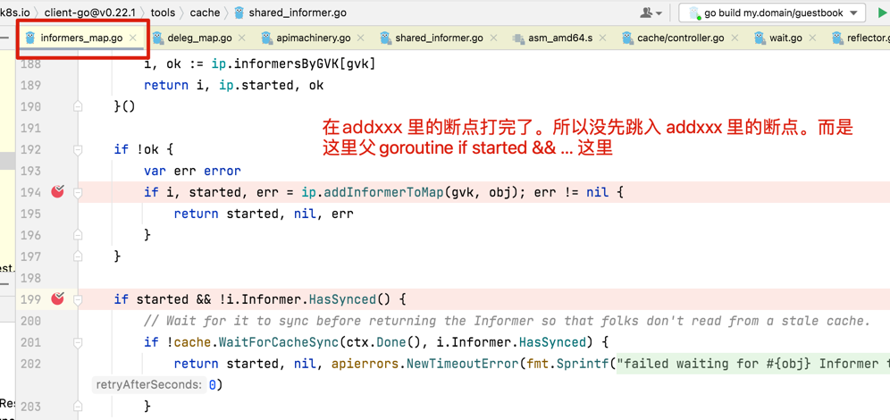

# 最难的是代码在几个 go routine 来回跳跃

为了强制变成顺序执行，可以在所有 goroutine 加断点。然后顺序单步
controller-runtime 启动部分可以这么看
先看nonleaderelection：go cm.startNonLeaderElectionRunnables()
再看 go func() { cm.startLeaderElectionRunnables() }()

# 把断点打在 go func() 所在行好像没有。
❌错误的想法：并且为了防止 goroutine 退出时不知道退出到哪里。goroutine 下一行代码也要打断点（是这样吗？下一行很可能直接跳到了）————-》 不是不是，是goroutine里的下一个断点如果打晚了。可能会先走父 goroutine 的下一行代码

？？？如果 main 中 goroutine 1 创建了 goroutine 2。如果只给goroutine 2（跨包 goroutine？？）打断点，不会中断到goroutine 2。是吗？

# 自己记笔记时不要解释部分不要中英混写。比如队列出栈，不要说队列pop。应为代码里可能有 pop。
/Users/huanggze/go/pkg/mod/k8s.io/client-go@v0.22.1/tools/cache/shared_informer.go
func (p *processorListener) pop() {

# 画类图
比如 Cache接口=Reader + Informers。Cache 的实现是 informerCache。informerCache包含一个内嵌的 informerMap。内嵌怎么用类图表示？？