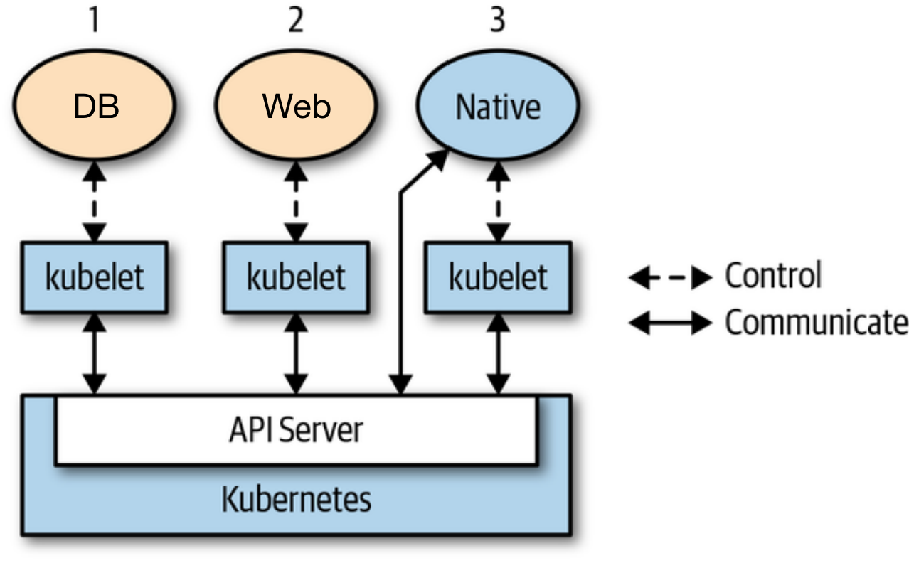

## Operator 控制器

K8s 定义了很多抽象内部资源来描述不同工作负载类型，比如 Deployment 用于无状态应用[^1]部署、StatefulSet 用于有状态应用、CronJob 适用于运行定时任务。

> Deployment 和 StatefulSet 的区别[^2]：
> - Deployment 创建的 Pod 之间没有顺序，服务通过 Service 的 Service IP 暴露。Deployment 也可以使用持久化存储卷实现有状态应用部署，但有使用限制。Deployment 只支持通过 .spec.template.spec.volumes.persistentVolumeClaim 引用一个 PVC（提前创建）。如果该 PVC 访问模式支持且设置为 RWO，Deployment 副本数量必须为 1（单 Pod）；否则，使用 RWX 模式，多个 Pod 共享存储。
> - StatefulSet：每个 Pod 有自己的存储，通过 .spec.volumeClaimTemplates 为每个 Pod 创建一个独立的 PV 保存其数据和状态。即使删除 StatefulSet 或 Pod 宕机，创建的 PVC 仍保留其数据并可以在 Pod 恢复后重新恢复绑定。StatefulSet 和无头服务配合使用（.spec.clusterIP=None），无头服务不做负载均衡，返回所有关联 Pod 的 IP 地址列表。

这些 K8s 内部资源的状态由对应资源的控制器来维护，比如 Deployment 对应 Deployment Controller。K8s 控制组件 kube-controller-manager 包含了所有内部资源控制器。控制器本质上是一个控制回路（control loop）无限循环进程，Watch 资源状态，并做出相应调整，调协当前状态（status）至期望状态（spec），如：滚动更新，恢复宕机的 Pod。对于运行在 Pod 中的程序，如下图[^3]中的 DB 和 Web 程序，他们本身并无感知自身运行在 K8s 环境中。应用运维由 K8s 控制器来完成。



虽然 K8s 在容器编排和基础设施层做了统一的抽象，实现了自动化运维，但对特定应用运维以及业务运维上，仍需要人力介入。比如，在 K8s 上安装、升级 Redis 集群，我们需要手动组装和更新多个 K8s 资源，包括：ConfigMap、StatefulSet、Service 等（或通过 Helm）。更复杂的场景是实现业务运维自动化，比如根据数据库某个表字段的更新，重启另一个业务应用。这种场景对控制器提出了更高的要求，要求控制器能拥有业务运维知识，根据特定业务场景自动化管理相关组件。Kubernetes 自身的基础模型元素已经无法支撑不同业务领域下复杂的自动化场景。于是，K8s 社区提出了 Custom Resource（CR）和 Operator 的概念。基于自定义资源和自定义资源控制器，来扩展原生 Kubernetes 的能力。

Operator 的开发者可以将业务相关的运维逻辑编写到 Operator 和 CR 中，并将 CR 应用到 K8s 集群。Operator 控制器通过访问 K8s API，像操作 Deployment 等内部资源一样，监听对应 CR 状态，并创建修改其他 K8s 内部资源或外部依赖。因此，不同于之前图片中橙色框中 DB 和 Web 应用，Operator 需要与 kube-apiserver 通信（C/S 架构）。一个 Operator 应用示例如下，我们可以定义一个 Database 类型（kind）的 CR 实现 Database Operator 声明式配置的方式一键部署数据库服务。

```yaml
kind: Database
metadata:
  name: mydb
spec:
  type: mysql
  user: root
  password: root
status:
  phase: Running
```

## Kubebuilder
从前文我们知道，开发一个 Operator 首先需要定义 CR 并完成 Operator 代码。K8s 社区提供了 Kubebuilder 开发框架。本节介绍如何实现前面提到的业务运维需求，监听数据库表字段变化，重启业务应用。我们将该 Operator 命名为 Autorebooter，并定义 RebootPolicy 自定义资源。在 RebootPolicy 中定义目标业务应用和数据库监听逻辑。总体上，我们需要定义一个 CR，一个 Operator，并部署到 K8s 集群上。 Kubebuilder 详细使用手册可参考官方开发文档[^4]。

### 初始化项目

安装 Kubebuilder，当前最新版本是 v2.3.0。

```bash
curl -L -o kubebuilder https://go.kubebuilder.io/dl/latest/$(go env GOOS)/$(go env GOARCH)
chmod +x kubebuilder && mv kubebuilder /usr/local/bin/
```

通过 Kubebuilder 创建 Autorebooter Operator：

```bash
cd autorebooter
kubebuilder init --domain my.domain --repo my.domain/autorebooter
```

接下来，为 CR 和 Operator 控制器创建模板代码。这里通过 `kubebuilder create api` 命令创建。group、version、kind 分别表示 CR 资源的 API 组、版本和资源类型名称。基本上所有 K8s 资源都有这三个部分，如 Job 是在 batch API Group 下，最新的稳定 API 版本是 v1。该 API Group 下的其他资源还包括 CronJob。GVK 是 K8s 源码中的重要概念，一个 GVK 唯一对应一种资源类型。我们会在本系列后面部分继续介绍。

```bash
kubebuilder create api --group autoreboot --version v1alpha1 --kind RebootPolicy
```

输入以上命令，当提示是否 `Create Resource [y/n]` 以及 `Create Controller [y/n]` 时，按 y 会创建以下项目结构：

```bash
.
├── api # CR
│   └── v1alpha1
│       ├── groupversion_info.go
│       ├── rebootpolicy_types.go # 自定义资源 Go 结构体声明
│       └── zz_generated.deepcopy.go # 自动生产的结构体深拷贝代码
├── bin
├── config # YAMl 文件
│   ├── crd # 自定义资源定义（Custom Resource Definition）
│   │       # 用于自定义资源注册和服务发现
│   ├── manager # Operator Deployment 部署 YAML 文件
│   │   ├── kustomization.yaml
│   │   └── manager.yaml
│   ├── rbac # RBAC 权限相关
│   └── samples # CR 实例
├── controllers
│   └─ rebootpolicy_controller.go # 控制器代码，实现了 k8s go-client
│                                 # 访问 kube-apiserver
├── go.mod
├── Dockerfile
├── Makefile # Operator 部署安装命令
└── main.go # Operator 入口程序
```

### 测试部署

api/valpha1/rebootpolicy_types.go 包含了自定义资源的 Go 代码，代码里默认定义了两个结构体 `RebootPolicy` 和 `RebootPolicyList`。测试部署，首先使用 `make install` 命令安装自定义资源定义（CustomResourceDefinition，CRD）文件到 K8s 集群（通过读取 ~/.kube/config，本地测试 K8s 环境可以使用 minikube）。CRD 是对自定义资源的结构化定义，定义了 CR 支持的字段、字段类型。使用 CR 前必须先创建并应用对应的 CRD。如下片段是默认创建出来的 CRD，定义了自定义资源 RebootPolicy，spec 里包含一个 foo 字段。

```yaml
# kubectl get crd rebootpolicies.autoreboot.my.domain -oyaml
apiVersion: apiextensions.k8s.io/v1
kind: CustomResourceDefinition
metadata:
  name: rebootpolicies.autoreboot.my.domain
spec:
  group: autoreboot.my.domain
  names:
    kind: RebootPolicy
    listKind: RebootPolicyList
    plural: rebootpolicies
    singular: rebootpolicy
  scope: Namespaced
  versions:
  - name: v1alpha1
    schema:
      openAPIV3Schema:
        description: RebootPolicy is the Schema for the rebootpolicies API
        properties:
          apiVersion:
            description: 'APIVersion defines the versioned schema of this representation
              of an object. Servers should convert recognized schemas to the latest
              internal value, and may reject unrecognized values. More info: https://git.k8s.io/community/contributors/devel/sig-architecture/api-conventions.md#resources'
            type: string
          kind:
            description: 'Kind is a string value representing the REST resource this
              object represents. Servers may infer this from the endpoint the client
              submits requests to. Cannot be updated. In CamelCase. More info: https://git.k8s.io/community/contributors/devel/sig-architecture/api-conventions.md#types-kinds'
            type: string
          metadata:
            type: object
          spec:
            description: RebootPolicySpec defines the desired state of RebootPolicy
            properties:
              foo:
                description: Foo is an example field of RebootPolicy. Edit rebootpolicy_types.go
                  to remove/update
                type: string
            type: object
          status:
            description: RebootPolicyStatus defines the observed state of RebootPolicy
            type: object
        type: object
    subresources:
      status: {}
```

有了 RebootPolicy CRD，我们可以应用 config/samples 下的 CR：`kubectl apply -f config/samples/autoreboot_v1alpha1_rebootpolicy.yaml`。可以看到一个名为 rebootpolicy-sample 的 CR 已成功创建。我们可以像访问 K8s 内置资源一样，操作该自定义资源。

```bash
# 通过 kubectl 访问
$ kubectl get rebootpolicies rebootpolicy-sample
NAME                  AGE
rebootpolicy-sample   2m3s

# 通过 K8s API 访问
$ kubectl get --raw /apis/autoreboot.my.domain/v1alpha1/namespaces/default/rebootpolicies/rebootpolicy-sample
apiVersion: autoreboot.my.domain/v1alpha1
kind: RebootPolicy
metadata:
  annotations:
    kubectl.kubernetes.io/last-applied-configuration: |
      {"apiVersion":"autoreboot.my.domain/v1alpha1","kind":"RebootPolicy","metadata":{"annotations":{},"name":"rebootpolicy-sample","namespace":"default"},"spec":null}
  creationTimestamp: "2022-01-17T03:09:17Z"
  generation: 1
  name: rebootpolicy-sample
  namespace: default
  resourceVersion: "214734"
  uid: 208c992e-f134-470d-8bc8-97191c3a6c4f
```

Operator 也是通过访问 kube-apiserver 获取 CR 的状态。本地测试运行 Operator 可以使用 `make run` 命令（虽然现在 Operator 代码里没有任何业务逻辑）。

```bash
/Users/xxx/GolandProjects/autorebooter/bin/controller-gen rbac:roleName=manager-role crd webhook paths="./..." output:crd:artifacts:config=config/crd/bases
/Users/xxx/GolandProjects/autorebooter/bin/controller-gen object:headerFile="hack/boilerplate.go.txt" paths="./..."
go fmt ./...
go vet ./...
go run ./main.go
2022-01-17T11:24:56.834+0800    INFO    controller-runtime.metrics      metrics server is starting to listen    {"addr": ":8080"}
2022-01-17T11:24:56.835+0800    INFO    setup   starting manager
2022-01-17T11:24:56.835+0800    INFO    starting metrics server {"path": "/metrics"}
2022-01-17T11:24:56.835+0800    INFO    controller.rebootpolicy Starting EventSource    {"reconciler group": "autoreboot.my.domain", "reconciler kind": "RebootPolicy", "source": "kind source: /, Kind="}
2022-01-17T11:24:56.835+0800    INFO    controller.rebootpolicy Starting Controller     {"reconciler group": "autoreboot.my.domain", "reconciler kind": "RebootPolicy"}
2022-01-17T11:24:56.937+0800    INFO    controller.rebootpolicy Starting workers        {"reconciler group": "autoreboot.my.domain", "reconciler kind": "RebootPolicy", "worker count": 1}
```

### 定义自定义资源

根据业务需求，我们定义如下 CR。自定义资源 RebootPolicy 的 spec 字段由两部分组成：target 和 policies 数组。target 引用一个期望根据重启策略自动重启的应用，policies 定义一组重启触发策略。每一个触发器是一个探针，设计上参考了 Pod 的存活探针。示例中定义了一个重启触发策略 policy-1，它每隔 5 秒执行 Operator 里 /policies 目录下挂载的 diff.sh 脚本（连接、读取 MySQL 表字段值并与上一次的值比较）。一旦脚本退出码不为 0，重启 target 引用的工作负载。重启方式类似与 kubectl rollout restart 修改 .spec.template.metadata.annotations 字段 `kubectl.kubernetes.io/restartedAt: "2022-01-17T11:55:27+08:00"`。 

```yaml
apiVersion: autorebooting.demo.netease.com/v1alpha1
kind: RebootPolicy
metadata:
  name: rebootpolicy-sample
spec:
  target:
    apiVersion: apps/v1
    kind: Deployment
    name: nginx
  policies:
  - name: policy-1
    comment: xxx
    trigger:
      probe:
        exec:
          command: ["bash", "./scripts/diff.sh"]
        periodSeconds: 5
```

回到 api/valpha1/rebootpolicy_types.go 代码，修改 RebootPolicySpec 结构体，增加 Target 和 Policies 字段：

```go
import corev1 "k8s.io/api/core/v1"

// RebootPolicySpec defines the desired state of RebootPolicy
type RebootPolicySpec struct {
    // INSERT ADDITIONAL SPEC FIELDS - desired state of cluster
    // Important: Run "make" to regenerate code after modifying this file

    Target   Target   `json:"target,omitempty"`
    Policies []Policy `json:"policies,omitempty"`
}

type Target struct {
    metav1.TypeMeta `json:",inline"`
    Name            string `json:"name,omitempty"`
    // - 表示转 JSON 时忽略该字段。
    // 本示例中 target 都默认存在于与 CR 同命名空间下。
    // 增加该字段仅用于辅助编程。
    Namespace       string `json:"-"` 
}

type Policy struct {
    Name    string  `json:"name,omitempty"`
    Comment string  `json:"comment,omitempty"`
    Trigger Trigger `json:"trigger,omitempty"`
}

type Trigger struct {
    Probe *corev1.Probe `json:"probe,omitempty"`
}
```

重新 `make install` 安装 CRD。`make install` 会调用 `make manifests` 命令生成新的深拷贝代码以及更新后的 CRD YAML。

### 编写控制器

控制器本身是一个无限循环进程，一旦监听到 CR 的创建、修改、删除就会触发 controllers/rebootpolicy_controller.go 控制器代码里的调协函数 Reconcile()。所以业务逻辑都应该放在 Reconcile 里。后续文章我们会详细介绍 Kubebuilder 生成的其他模板代码的含义以及更多最佳实践。我们在 Reconcile 里编写代码如下：

```go
import prober "my.domain/autorebooter/pkg"

func (r *RebootPolicyReconciler) Reconcile(ctx context.Context, req ctrl.Request) (ctrl.Result, error) {
    _ = log.FromContext(ctx)

    // TODO(user): your logic here
    // CR 事件触发 Reconcile。
    // 第一步，先获取 CR 对象
    rp := &autorebooterv1alpha1.RebootPolicy{}
    err := r.Get(ctx, req.NamespacedName, rp)
    if err != nil {
        return ctrl.Result{}, err
    }
    // 第二步，拿到要重启的目标工作负载
    // 并默认设置该工作负载在与 CR 同名的命名空间下
    t := rp.Spec.Target
    t.Namespace = req.Namespace

    // 第三步，初始化探针
    // 实现上参考了 kubelet probe_manager 源码
    prober.Init(r, t)
    for _, p := range rp.Spec.Policies {
        // 启动后台 goroutine，周期性地探测，
        // 并根据策略重启执行重启
        prober.AddProbe(ctx, p)
    }

    return ctrl.Result{}, nil
}
```

一旦触发 Reconcile()，代码执行四步操作：第一步，拿到最新的 CR，底层原理上并不是通过访问 kube-apiserver 从 etcd 拿数据，而是使用本地缓存，这样避免频繁与 kube-apiserver 通信；第二步，从 CR 获取我们要实现自动重启的目标工作负载；第三步，初始化探针管理，并根据定义的重启探针策略，创建后台探针 goroutine 周期性地执行探针检测，并按需要重启目标应用（打 annotation 补丁）。这里写回操作是请求发往 kube-apiserver。

prober.Init 和 prober.AddProbe 是我们定义的代码，参考了 kubelet probe_manager 源码。代码可以放在 /pkg 目录下 probe_manager.go 和 worker.go。在 probe_manager.go 定义了一个内部 probe manager，调用 Init 函数初始化该 manager；调用 AddProbe 则会启动一个 worker 协程，并加入到 workers 数组中。

```go
// probe_manager.go

type manager struct {
    client  client.Client
    workers []worker
    target  v1alpha1.Target
}

var (
    once            sync.Once
    internalManager *manager
)

func Init(c client.Client, t v1alpha1.Target) {
    once.Do(func() {
        internalManager = &manager{
            client:  c,
            workers: []worker{},
        }
    })

    for _, w := range internalManager.workers {
        w.stop()
    }
    internalManager.workers = []worker{}
    internalManager.target = t
}

func AddProbe(ctx context.Context, p v1alpha1.Policy) {
    w := newWorker(internalManager.client, internalManager.target, p.Trigger.Probe)
    internalManager.workers = append(internalManager.workers, w)
    go w.run(ctx)
}
```

worker.go 代码管理 worker 后台协程的生命周期。run() 中会先做 doProbe 探测，比如执行 exec 探针运行 shell 脚本。如果返回码不为 0，则认为需要重启并调用 rolloutRestart()。rolloutRestart 先确定目标工作负载的 API 类型（GVK），然后执行 Patch 操作更新。

```go
// worker.go

const patchJSON = `{"spec": {"template": {"metadata": {"annotations": {"autorebooter.my.domain/restartedAt": "%s"}}}}}`

type worker struct {
    client.Client
    stopCh chan struct{}
    // Describes the probe configuration (read-only)
    target v1alpha1.Target
    spec   *corev1.Probe
}

func newWorker(c client.Client, target v1alpha1.Target, spec *corev1.Probe) worker {
    stopChan := make(chan struct{})
    return worker{c, stopChan, target, spec}
}

func (w *worker) run(ctx context.Context) {
    l := log.FromContext(ctx)

    probeTickerPeriod := time.Duration(w.spec.PeriodSeconds) * time.Second
    probeTicker := time.NewTicker(probeTickerPeriod)

probeLoop:
    for {
        shouldReboot, err := w.doProbe()
        if err != nil {
            l.Error(err, "fail to probe")
        }
        if shouldReboot {
            // reboot target
            err = w.rolloutRestart(ctx)
            if err != nil {
                l.Error(err, "fail to rollout restart")
            }
        }

        // Wait for next probe tick.
        select {
        case <-ctx.Done():
            break probeLoop
        case <-w.stopCh:
            break probeLoop
        case <-probeTicker.C:
            // continue
        }
    }
}

func (w *worker) doProbe() (bool, error) {
    var result probe.Result
    var err error
    if w.spec.Exec != nil {
        if len(w.spec.Exec.Command) != 0 {
            p := execprobe.New()
            cmd := util.New().Command(w.spec.Exec.Command[0], w.spec.Exec.Command[1:]...)
            result, _, err = p.Probe(cmd)
        }
    }
    if err != nil {
        return false, err
    }
	
    return result == probe.Failure, nil
}

func (w *worker) stop() {
    select {
    case w.stopCh <- struct{}{}:
    default: // Non-blocking.
    }
}

// inspired by kubectl rollout restart
// refer to https://github.com/kubernetes/kubectl/blob/release-1.16/pkg/polymorphichelpers/objectrestarter.go#L32
func (w *worker) rolloutRestart(ctx context.Context) error {
    targetGV, err := schema.ParseGroupVersion(w.target.APIVersion)
    if err != nil {
        return err
    }
    gvk := schema.GroupVersionKind{
        Group:   targetGV.Group,
        Version: targetGV.Version,
        Kind:    w.target.Kind,
    }

    switch gvk {
    case schema.GroupVersionKind{Group: "apps", Version: "v1", Kind: "Deployment"}:
        // Patch
        obj := &appv1.Deployment{
            ObjectMeta: metav1.ObjectMeta{
                Name:      w.target.Name,
                Namespace: w.target.Namespace,
            },
        }
        patchData := []byte(fmt.Sprintf(patchJSON, time.Now().Format(time.RFC3339)))
        return w.Patch(ctx, obj, client.RawPatch(types.StrategicMergePatchType, patchData))
    case schema.GroupVersionKind{Group: "apps", Version: "v1", Kind: "StatefulSet"}: // todo
    case schema.GroupVersionKind{Group: "apps", Version: "v1", Kind: "DaemonSet"}: // todo
    }

    return nil
}
```

至此，我们代码逻辑已完成，现在可以在本地 K8s 集群上测试（如，minikube）：
1. `make install & kubectl apply -f config/samples/autoreboot_v1alpha1_rebootpolicy.yaml` 安装 CRD 和 CR。在我们的 RebootPolicy 中设置了脚本路径为 ./scripts/diff.sh。这个脚本的内容是连接本地 mysql，访问比较 demo_tbl 表的 name 字段。

```bash
#!/bin/bash
HOST=127.0.0.1
USER=root
PASSWORD=root
DATABASE_NAME=demo
TABLE_NAME=demo_tbl
OLDFILE=oldout.tmp
NEWFILE=newout.tmp

# install mysql
which mysql
if [ $? != 0 ] && [ $IS_INSTALLING_MYSQL == 1 ]; then
    apt-get install mysql-client -y
    export IS_INSTALLING_MYSQL=1
fi

# connect to mysql
mysql -h$HOST -u$USER -p$PASSWORD << EOF > $NEWFILE
  USE $DATABASE_NAME;
  SELECT name FROM $TABLE_NAME;
EOF

# compare
if [ -f $OLDFILE ]
then
  diff $NEWFILE $OLDFILE > /dev/null
  RET=$?
  # promote new output to old
  mv $NEWFILE $OLDFILE
  if [ $RET != 0 ]; then
    exit 1
  fi
else
  mv $NEWFILE $OLDFILE
fi
```

2. 准备本地 MySQL 环境（用户名/密码：root），部署目标应用（和 rebootpolicy-sample.spec.target 的描述一致）：

```sql
CREATE TABLE IF NOT EXISTS `demo_tbl`(
    `id` INT UNSIGNED AUTO_INCREMENT,
    `name` VARCHAR(100) NOT NULL,
    PRIMARY KEY ( `id` )
)

INSERT INTO demo_tbl (name) VALUES ("aaa");
INSERT INTO demo_tbl (name) VALUES ("bbb");
```

```bash
kubectl create deployment nginx --image=nginx:1.14.2 --replicas=3  --port=80
```

3. `make run` 本地运行 Operator

4. 在 MySQL 中修改 name 列，观察 kubectl get po 可以看到 Pod 全部重启。

```sql
UPDATE demo_tbl SET name="ccc" WHERE id=1;
```

```bash
$ kubectl get po
NAME                     READY   STATUS              RESTARTS   AGE
nginx-56bc45d9f7-5kps5   1/1     Running             0          2s
nginx-56bc45d9f7-7f4zk   0/1     ContainerCreating   0          0s
nginx-6795d6456-hqm4r    1/1     Running             0          62s
nginx-6795d6456-p68wl    1/1     Running             0          59s
nginx-6795d6456-rklrt    1/1     Terminating         0          60s
```

### 部署与 RBAC

测试通过后，可以打包 Operator 和 CR，CRD 到正式环境。Operator 以 Deployment 形式部署。但在部署到 Operator 到正式环境前，我们还需要额外部署 RBAC 资源，否则，查看 Operator 日志会发现 Operator 没有权限操作 Deployment API。我们在本地测试环境可以正常运行，是因为使用了集群管理员 kubeconfig，拥有对所有 K8s API 的访问权限。

Kubernetes 使用基于角色的访问控制（role-based access control，RBAC）进行鉴权[^5]。我们的 Operator 使用了三种 RBAC 资源：ClusterRole，ClusterRoleBinding 和 ServiceAccount。三个 YAML 文件在 /config/rbac 目录下。ClusterRole 定义了允许访问的资源（如 apps.deployment）以及允许的操作（patch）。ServiceAccount 是挂载到Pod 里的服务账户（通过 Pod YAML 里 serviceAccountName 字段）。在没有指定 kubeconfig 文件路径的情况，Operator 默认使用服务账户里的 token（容器内路径：/var/run/secrets/kubernetes.io/serviceaccount/token）访问 kube-apiserver。ClusterRoleBinding 给 ServiceAccount 绑定一个 ClusterRole。

> Role 和 ClusterRole 的区别在于作用范围（scope），前者是操作指定命名空间下资源的角色，后者作用于整个集群所有命名空间。

```yaml
apiVersion: v1
kind: ServiceAccount
metadata:
  name: controller-manager
---
apiVersion: rbac.authorization.k8s.io/v1
kind: ClusterRole
metadata:
  name: manager-role
rules:
  - apiGroups:
      - apps
    resources:
      - deployments
    verbs:
      - patch
  - apiGroups:
      - autoreboot.my.domain
    resources:
      - rebootpolicies
    verbs:
      - get
      - list
      - watch
---
apiVersion: rbac.authorization.k8s.io/v1
kind: ClusterRoleBinding
metadata:
  name: manager-rolebinding
roleRef:
  apiGroup: rbac.authorization.k8s.io
  kind: ClusterRole
  name: manager-role
subjects:
  - kind: ServiceAccount
    name: controller-manager
```

这些 RBAC 资源不需要手动创建。Kubebuilder 框架支持自动生成正确的 RBAC 资源 YAML，只需要在 rebootpolicy_controller.go 代码里加上以下 tag 即可，通过 `make manifests` 命令创建相关 YAML。

```go
//+kubebuilder:rbac:groups=autoreboot.my.domain,resources=rebootpolicies,verbs=get;list;watch
//+kubebuilder:rbac:groups=apps,resources=deployments,verbs=patch
```

至此，我们已全部介绍完 Operator 概念、Kubebuilder 框架以及如何实现一个 Operator。后续会介绍 Kubebuilder 架构、源码阅读以及 Operator 开发最佳实践。

[^1]: [从 Docker 到 Kubernetes 进阶: DaemonSet 与 StatefulSet 的使用](https://www.qikqiak.com/k8s-book/docs/32.DaemonSet%20%E4%B8%8E%20StatefulSet.html)

[^2]: [Kubernetes Deployment vs. StatefulSets](https://www.baeldung.com/ops/kubernetes-deployment-vs-statefulsets)

[^3]: [Programming Kubernetes: Developing Cloud-Native Applications](https://book.douban.com/subject/33393681/)

[^4]: [The Kubebuilder Book](https://book.kubebuilder.io/)

[^5]: [Kubernetes 文档：使用 RBAC 鉴权](https://kubernetes.io/zh/docs/reference/access-authn-authz/rbac/)