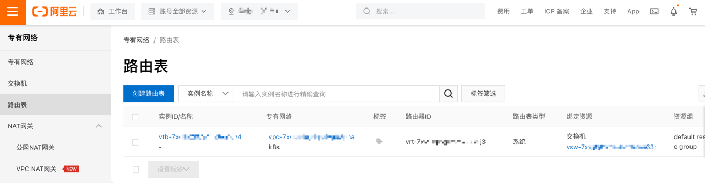
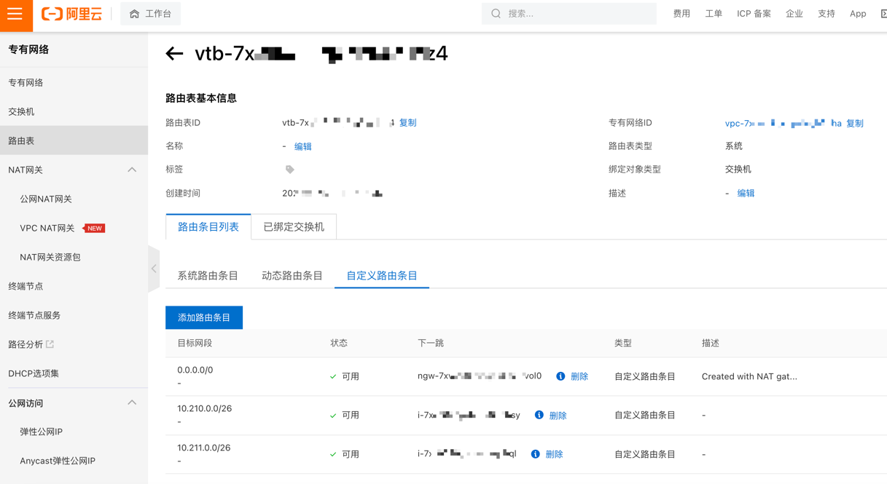

# 为什么有的 Pod 的 IP 不是从 Pod CIDR 中分配的？

因为 .spec.hostNetwork 字段为 True

```bash
NAMESPACE      NAME                                                      READY   STATUS      RESTARTS       AGE     IP             NODE                        NOMINATED NODE   READINESS GATES
kube-system    kube-flannel-ds-92knn                                     1/1     Running     1 (5h2m ago)   6h54m   192.168.0.87   cn-guangzhou.192.168.0.87   <none>           <none>
kube-system    kube-proxy-worker-f9dxq                                   1/1     Running     1 (5h2m ago)   6h54m   192.168.0.87   cn-guangzhou.192.168.0.87   <none>           <none>
kube-system    metrics-server-b9cb4b88f-wmzdr                            1/1     Running     1 (5h2m ago)   6h56m   10.210.0.22    cn-guangzhou.192.168.0.87   <none>           <none>
kube-system    nginx-ingress-controller-5c45d8549b-ftlld                 1/1     Running     1 (5h2m ago)   6h56m   10.210.0.29    cn-guangzhou.192.168.0.87   <none>           <none>
kube-system    nginx-ingress-controller-5c45d8549b-z5mnn                 1/1     Running     1 (5h2m ago)   6h56m   10.210.0.21    cn-guangzhou.192.168.0.87   <none>           <none>
kube-system    node-local-dns-sbvqm                                      1/1     Running     1 (5h2m ago)   6h54m   192.168.0.87   cn-guangzhou.192.168.0.87   <none>           <none>
```


# 为什么跨集群的 Pod IP 可以 ping，而跨集群的 Service 的 Cluster IP 不能？

service的clusterip不支持跨集群访问呢。您这边使用内网的slb暴露service呢

那为什么pod IP 可以跨集群访问？是什么原理呢？

podip是因为您的路由表存在对应的网段的下一跳节点呢

这个路由表我在哪里可以看到？clusterip 为什么不配路由表呢？

路由表您可以再vpc网络中找到呢，clusterip这个是虚拟的ip，外部网络无法访问的呢

虚拟的 IP 是啥意思？是只记录在 K8s DNS 域名服务器上的 IP 吗？我的理解对吗？

可以这么理解，Cluster IP仅仅作用于Kubernetes Service这个对象，没有对应的实体对象


专有网络 > 路由表 > <路由表 ID>



